# 第七章 运算符重载

+++

[TOC]

+++


## 运算符重载规则

1. 不可以重载的运算符记忆方法：带“.”的都不能重载，！除外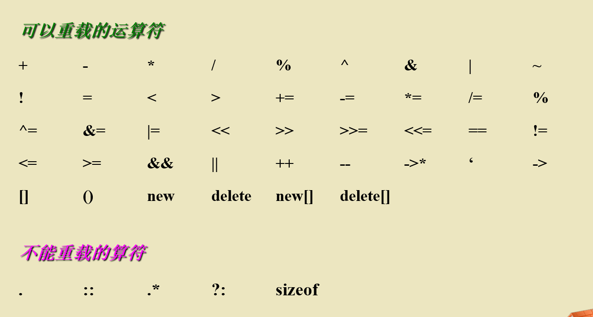

2. 基本要求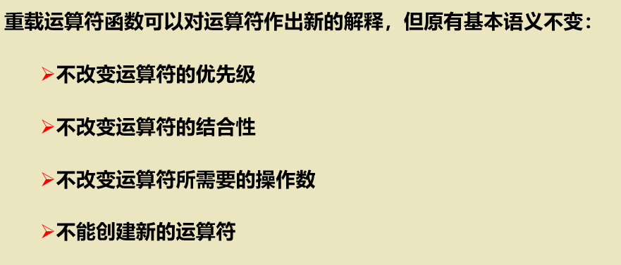

3. 语法形式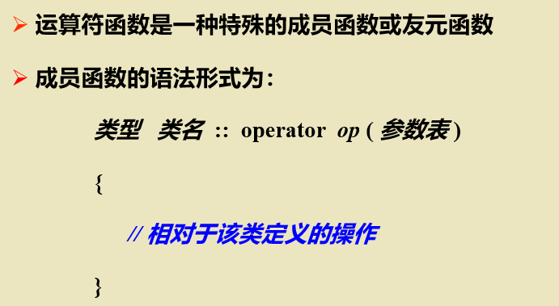

4. 示例 (一个安全计数器)

   `````c++
   #include<iostream>
   #include<cstdlib>
   using namespace std;
   class Calculator
   { public:
       Calculator() { value = 0 ; } ;
       void operator ++ () ;
       void operator -- () ; 
       unsigned int operator() () ;
     private:
       unsigned int value;
   }; 
   int main()
   { Calculator Counter ;
      int i ;
      for( i = 0 ; i < 5 ; i ++ )
         { ++ Counter;//等价于Counter.operater++();
            cout << "\n Counter = " << Counter() ;
         }
      for( i = 0 ; i <= 5 ; i ++ )
         { -- Counter;//等价于Counter.operater--();
            cout << "\n Counter = " << Counter()；//等价于Counter.operater()();
         }
   } 
   void Calculator::operator ++ ()
   { if ( value < 65535 ) value ++ ;
     else
       { cout << "\nData overflow !" << endl ;
         exit( 0 ) ;
       }
   } 
   void Calculator::operator --()
   { if ( value > 0 ) value -- ;
     else
       { cout << "\n Data overflow !" << endl ;
         exit( 0 ) ;
       }
   }
   unsigned int Calculator::operator() ()
   { return value ; }
   `````

   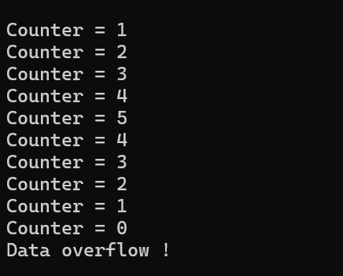
   
5. 赋值运算符‘=’和地址运算符‘&’系统会自动提供重载版本，当然也可以自定义重载

+++


###  用成员函数重载运算符

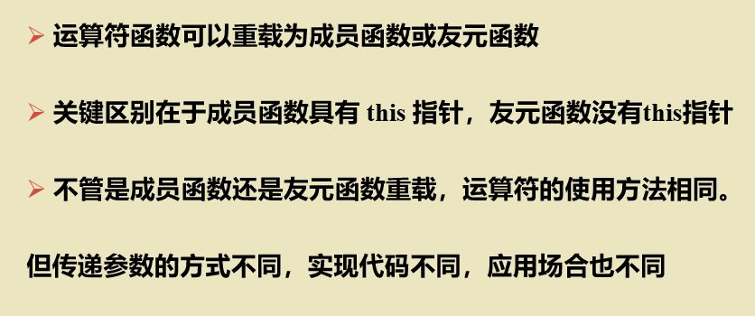

1. 一元运算符

   

2. 二元运算符)

3. 三元运算符

   三元运算符只有唯一一个‘?’，然而这个运算符不能重载

4. 一个实例

   ```c++
   #include<iostream>
   using namespace std;
   class TriCoor
   { public:
          TriCoor( int mx = 0, int my = 0, int mz = 0 ) { x = mx ; y = my ; z = mz ; }
          TriCoor operator + ( TriCoor t ) 
             { TriCoor temp ;
                temp.x = x+t.x ;  temp.y = y+t.y ;  temp.z = z+t.z ;
                return temp ;
             }
          TriCoor operator = ( TriCoor t ) { x = t.x ;  y = t.y ;  z = t.z ;  return * this ; }
          TriCoor operator ++ () { x ++ ;  y ++ ;  z ++ ;  return *this ; }
          void show() { cout << x << " , " << y << " , " << z << "\n"; }
          void assign( int mx, int my, int mz ) { x = mx;  y = my;  z = mz; }
     private:       int x, y, z ;	// 3_d coordinates
   } ;
    
   int main()
   { TriCoor a( 1, 2, 3 ), b, c ;
     a.show();  b.show();  c.show();
     for( int i = 0;  i < 5;  i ++ ) ++ b;      b.show() ;
     c.assign( 3, 3, 3 ) ;    c = a + b + c ;    c.show() ;
     c = b = a ;    c.show() ;
   } 
   
   ```

   + 结果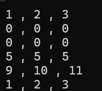

     + 变式1

       + ```c++
         const TriCoor operator + (TriCoor t)
          {
              TriCoor temp;
              temp.x = x + t.x;  temp.y = y + t.y;  temp.z = z + t.z;
              return temp;
          }
         //修改'+'的重载，返回值为const
         ```

       + 报错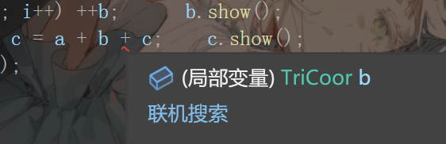

       + 修改方案

         ```c++
         const TriCoor operator + (TriCoor t)const
         {
             TriCoor temp;
             temp.x = x + t.x;  temp.y = y + t.y;  temp.z = z + t.z;
             return temp;
         }
         ```

       + 理论分析：常对象不能调用成员函数，但是常对象能够调用常成员函数

     + 变式2（在变式1的基础上）

        + 
     
     
        ```c++
        TriCoor operator = (TriCoor& t) { x = t.x;  y = t.y;  z = t.z;  return *this; }
        //修改 '=' 的参数类型
        ```
     
        + 报错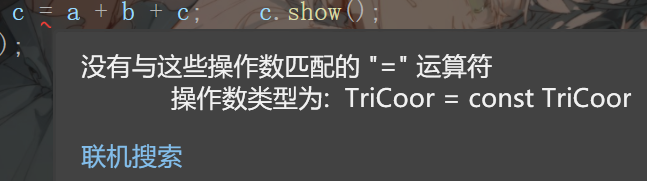
     
        + 修改方案
     

        ```c++
         TriCoor operator = (const TriCoor& t) { x = t.x;  y = t.y;  z = t.z;  return *this; }
        ```
     
        + 理论分析:参数为引用类型时只能接受可变对象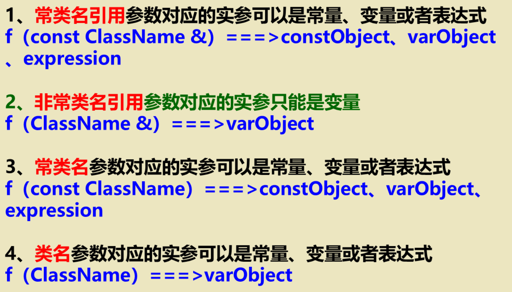
        + 
     
     
     
     

### 用友元函数重载运算符

1. 在某个参数需要隐式转换的时候，采用友元函数重载运算符（会自动调用类的构造函数实现隐式转换）。

2. 不能用友元函数重载的运算符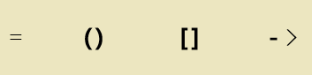

3. 实例（复数运算）

   1. ```c++
       #include<iostream>
      using namespace std;
      class Complex
      { public:
            Complex( double r =0, double i =0 ) { Real = r ;   Image = i ; }
            Complex(int a) { Real = a ;  Image = 0 ; } 
            void print() const ;
            friend Complex operator+ ( const Complex & c1, const Complex & c2 ) ;
            friend Complex operator- ( const Complex & c1, const Complex & c2 ) ;
            friend Complex operator- ( const Complex & c ) ;
        private:  
            double  Real, Image ;
      };
      Complex operator + ( const Complex & c1, const Complex & c2 )
        { double r = c1.Real + c2.Real ;  double i = c1.Image+c2.Image ;
           return Complex ( r,  i ) ;
        }
      Complex operator - ( const Complex & c1, const Complex & c2 )
        { double r = c1.Real - c2.Real ;  double i = c1.Image - c2.Image ;
           return Complex ( r,  i ) ;
        }
      Complex operator- ( const Complex & c )
        { return Complex ( -c.Real, - c.Image ) ; }
      void Complex :: print() const
        { cout << '(' << Real << " , " << Image << ')' << endl ; }
      int main()
      { Complex  c1( 2.5,3.7 ), c2( 4.2, 6.5 ) ;
         Complex c ;
         c = c1 - c2 ;	// operator-(c1,c2)
         c.print() ;
         c = 25 + c2 ;	// operator+(25,c2)
         c.print() ;
         c = c2 + 25 ;	// operator+(c2,52)
         c.print() ;
         c = - c1 ;	// operator-(c1)
         c.print() ;
      }
      ```

   2. 这里如果**不用**友元函数重载，c = 25 + c2会报错，这是因为常量不是Complex类型不能调用‘+’的重载

### 常用的重载运算符

#### 重载前置++和后置++（自减同理）

1. 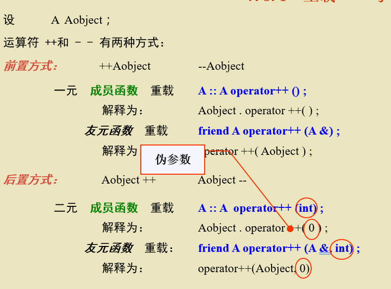

2. 重载后置++运算符，需要视为二元函数的重载，只不过需要一个为参数int(伪参数)

3. 实例：前置和后置的区别

4. ```c++
   #include<iostream>
   using namespace std;
   class  Increase
   {
   public:
       Increase() { value = 0; }
       void  display()  const { cout << value << '\n'; };
       Increase  operator ++ (); 	     // 前置
       Increase  operator ++ (int);    // 后置
   private:   unsigned  value;
   };
   Increase  Increase :: operator ++ ()
   {
       value++;   return *this;
   }
   Increase  Increase :: operator ++ (int)
   {
       Increase  temp;   temp.value = value++;   return  temp;//这里需要创建一个temp区别前置++，先执行了temp.value = value ，value++
   }
   int main()
   {
       Increase   a, b, n;    int  i;
       for (i = 0; i < 10; i++)  a = n++;
       cout << "n= ";  n.display();   cout << "a= ";   a.display();
       for (i = 0; i < 10; i++)  b = ++n;
       cout << "n= ";   n.display();   cout << "b= ";   b.display();
   }
   
   ```

   结果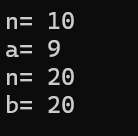

   这里同时说明了一个事情，c++预定义中的++后置运算速度慢于前置的原因：多构造了一个临时变量。

   注意：后置++的为参数在函数体内不能使用，否则非法操作。
   
   

#### 赋值运算符=

1. 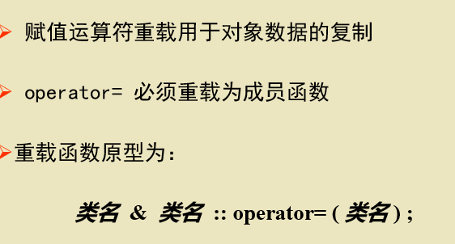

2. 实例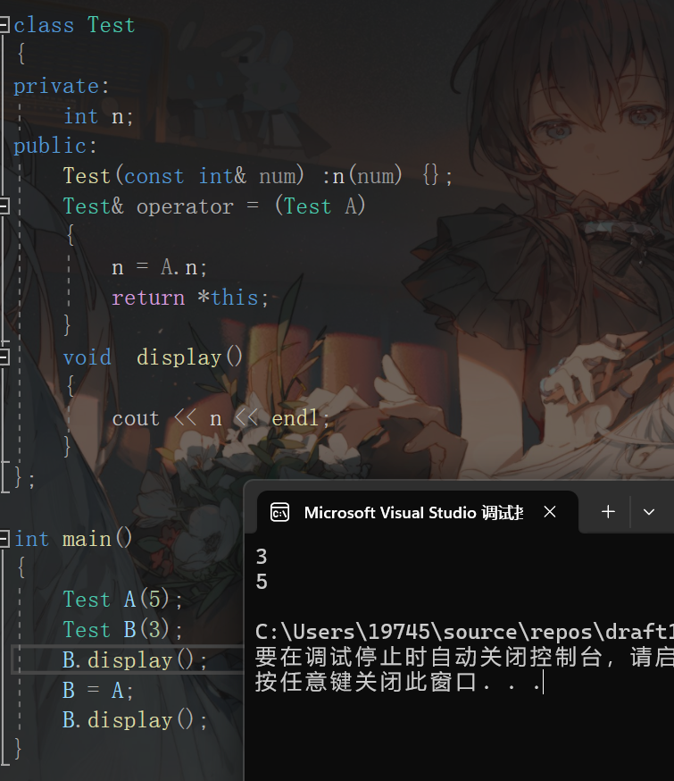

   一定要返回引用类型吗？不一定需要，返回引用类型有助于连续赋值

3. 注意赋值运算符只能通过成员函数来重载，不能被继承。

4. 系统提供的重载赋值函数只能拿实现简单的赋值（同理复制构造函数的浅复制）

#### 下标运算符[]和{}

1. 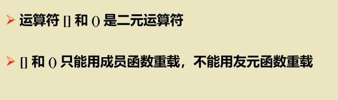

2. 实例：修改类数组的值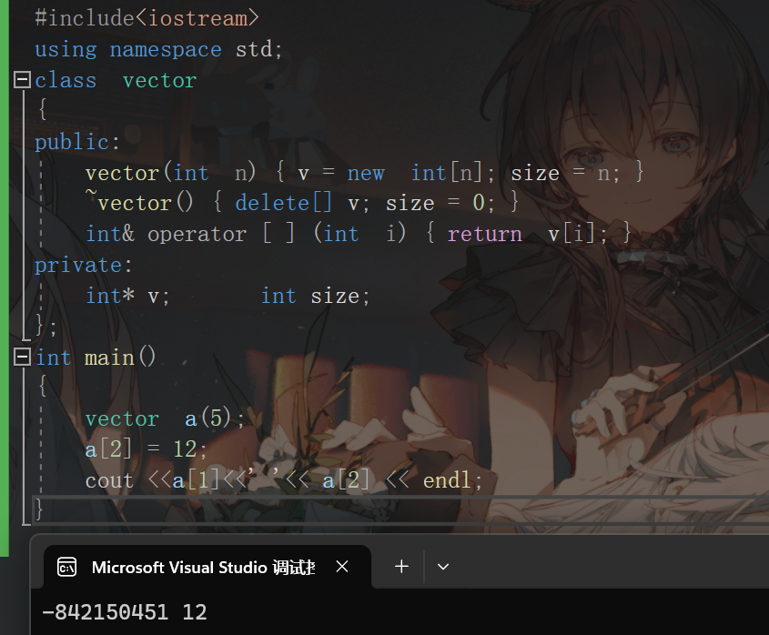注意此时类中数组的其他值是垃圾值，只修改了一个值

   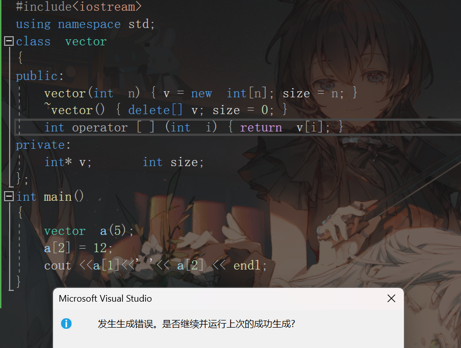

   这样为什么又报错了呢？

   **对于常用的数据类型，左值必须为引用类型**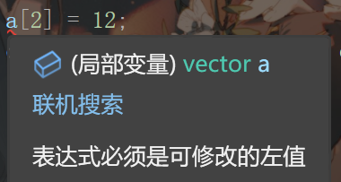

#### 函数调用符()

1. 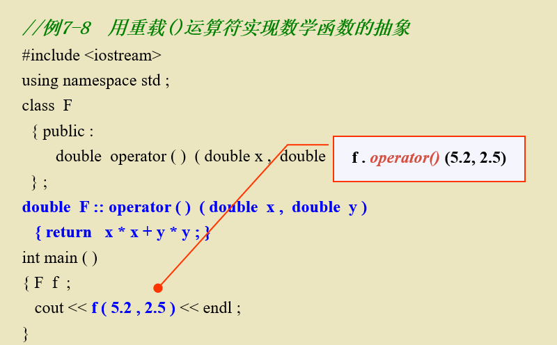

#### 流插入>>和流提取<<运算符

1. 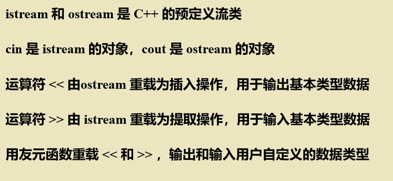
2. 重载流插入运算符>>，如果需要在函数里用原来的>>，需要传入参数ostream& output（一定要是引用类型）；同理重载流提取运算符<<，需要传入istream& input
3. 实例：创建向量
   1. 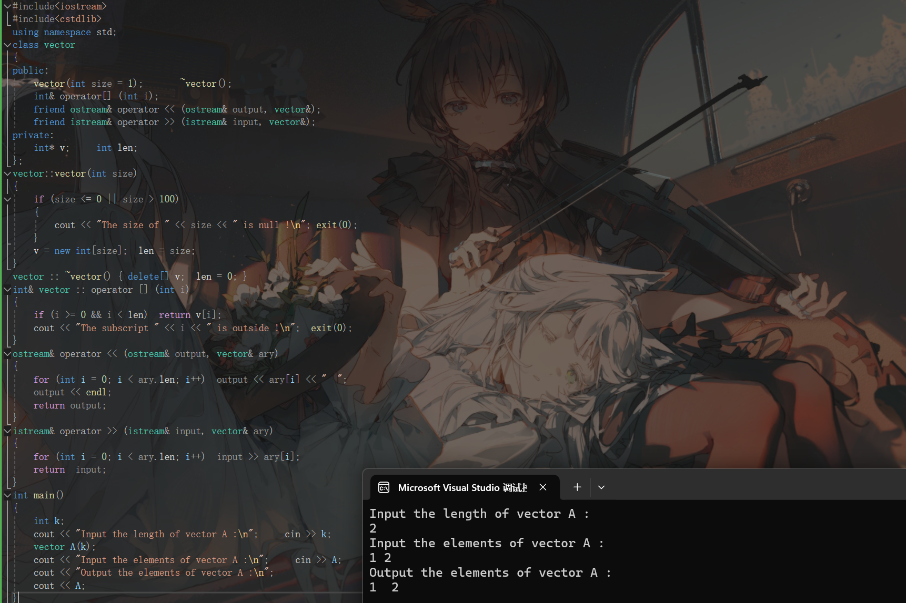
   2. 如果一定要重载为成员函数，在调用的时候要使用正确的调用方法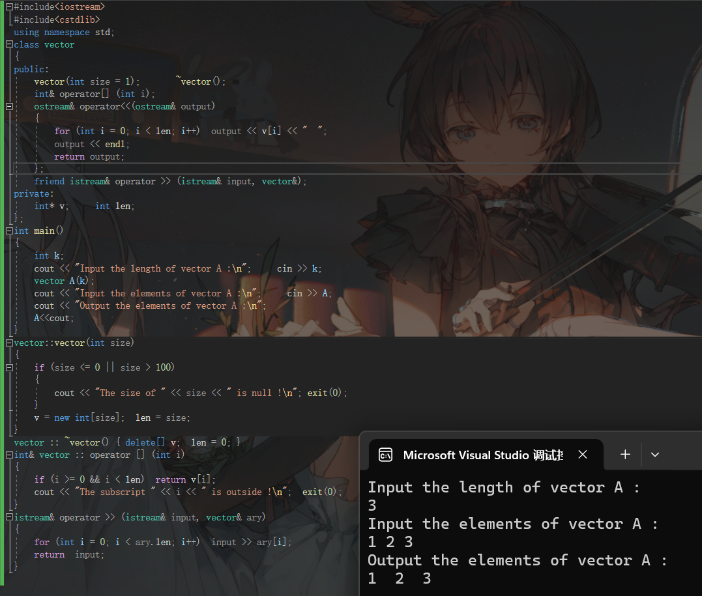不同之处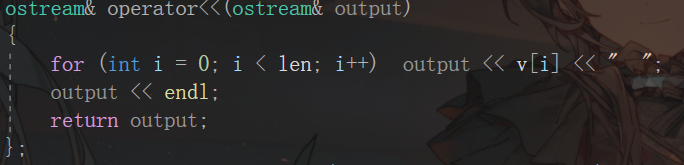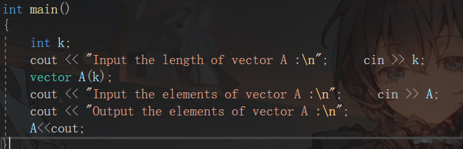

+++


## 类类型转换

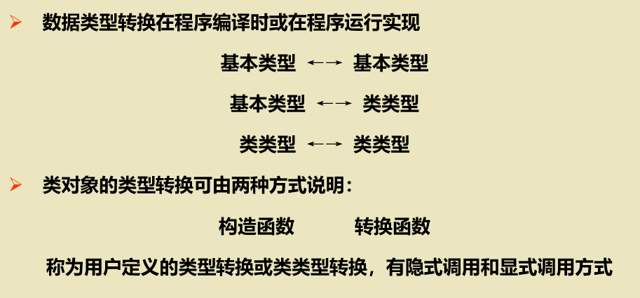


### 利用构造函数进行类类型转换

1. 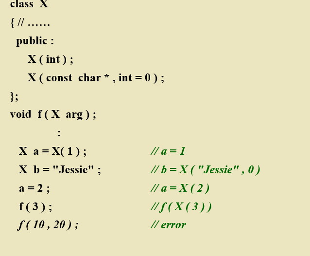

   这里创建b利用了复制构造函数；调用f函数的时候把int类型3，转化为X类型；赋值a也是先构造一个X(2)再赋值（浅复制)。**这些都需要有单参数的构造函数，默认参数不计算在内**

### 类型转换函数

1. 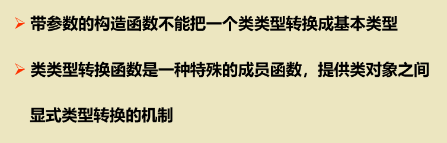

2. 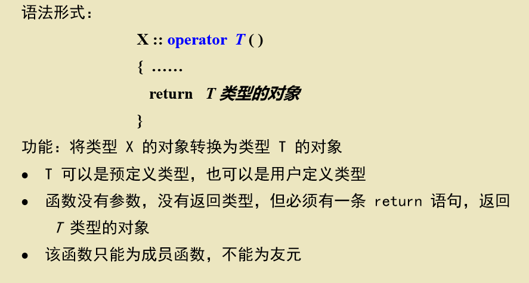

3. 在程序中通常隐式调用，但要确保没有二义性。

4. 类型转换函数不能被重载（没有参数），可以被继承，可以是虚函数。

5. 实例：有理数计算

6. ```c++
   #include<iostream>
   using namespace std;
   class Rational
   {
   public:
       Rational();			//构造函数
       Rational(int n, int d = 1);		//构造函数
       Rational(double x);		//构造函数，double-->Rational
       operator double(); 		//类型转换函数，Rational-->double
       friend Rational operator+(const Rational&, const Rational&);
       friend ostream& operator<<(ostream&, const Rational&);
   private:
       int  Numerator, Denominator;
   };
   int gcd(int a, int b);		//求最大公约数
   int main()
   {
       Rational a(2, 4);
       Rational b = 0.3;
       Rational c = a + b;
       cout << double(a) << " + "  <<  double(b)  <<  " = "  <<  double(c)  <<  endl ; 
       cout << a << " + " << b << " = " << c << endl;
       double x = b;
       c = x + 1 + 0.6;
       cout << x << " + " << 1 << " + " << 0.6 << " = " << double(c) << endl;
       cout << Rational(x) << " + " << Rational(1) << " + " << Rational(0.6) << " = " << c << endl;
   }
   Rational::Rational()	//构造等于0的对象
   {
       Numerator = 0; Denominator = 0;
   }
   Rational::Rational(int n, int d)    //用分子、分母构造对象
   {
       int g;
       if (d == 1)	               //分母等于1
       {
           Numerator = n;	 //分子
           Denominator = d;	 //分母
       }
       else		               //分母不等于1的有理数
       {
           g = gcd(n, d);	 //求分子、分母的最大公约数
           Numerator = n / g;       //约分
           Denominator = d / g;
       };
   }
   Rational::Rational(double x)	//用实数构造对象
   {
       int a, b, g;
       a = int(x * 1e5);		//分子
       b = int(1e5);		//分母
       g = gcd(a, b);		//求分子、分母的最大公约数
       Numerator = a / g;	//约分
       Denominator = b / g;
   }
   Rational::operator double() //类型转换函数，Rational-->double
   {
       return double(Numerator) / double(Denominator);
   }
   //重载运算符 + 
   Rational operator+(const Rational& r1, const Rational& r2)
   {
       int n, d;
       n = r1.Numerator * r2.Denominator
           + r1.Denominator * r2.Numerator;
       d = r1.Denominator * r2.Denominator;
       return  Rational(n, d);
   }
   //重载运算符 << 
   ostream& operator<<(ostream& output, const Rational& x) {
       output << x.Numerator;
       if (x.Denominator != 1)
           output << "/" << x.Denominator;
       return output;
   }
   int gcd(int a, int b)	//求最大公约数
   {
       int g;
       if (b == 0) g = a;
       else g = gcd(b, a % b);
       return g;
   }
   
   
   ```

   结果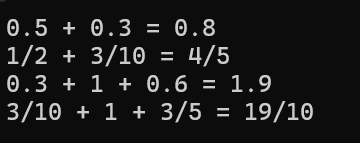

   

   

