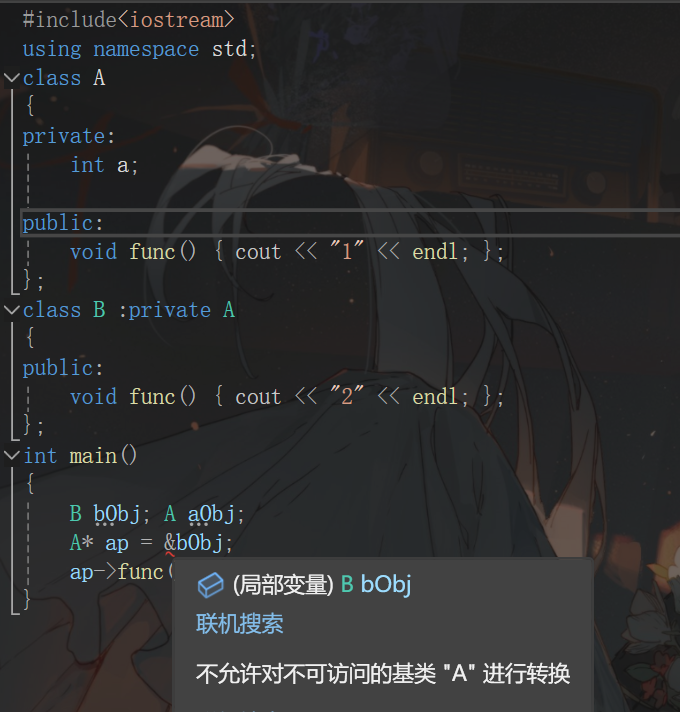
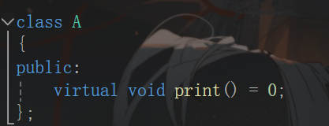
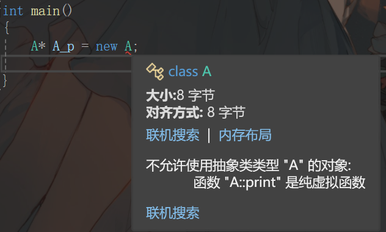
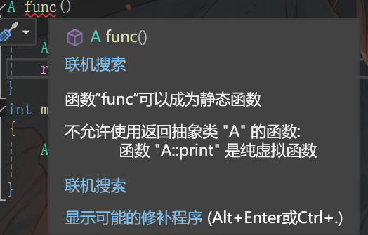

# 第九章 虚函数与多态性

+++

[TOC]

++++

## 9.1 静态联编

​	静态联编，是程序的匹配、连接在编译阶段实现，也称为早期匹配。重载（函数、运算符）使用静态联编。

​	动态联编是指程序联编推迟到运行时进行，所以又称为晚期联编。switch语句和 if 语句是动态联编的例子。通过虚函数实现，“一个接口，多种方法”。

### 普通成员函数重载

+ 类说明中重载
+ 基类成员在派生类重载
  + 根据参数不同区分
  + 使用::作用域不同区分
  + 根据调用对象区分（this指针)

+++


## 9.2 类指针的关系

### 类指针和类对象的关系

+ 直接用基类指针引用基类对象；
+ 直接用派生类指针引用派生类对象；
+ 用基类指针引用一个派生类对象；
+ 用派生类指针引用一个基类对象。

这里的引用指的是：指向对象

不论是指向基类还是派生类，指针类型在定义时就确定了，只是指向的对象类型不一定是相同类型的

### 基类指针引用派生类对象


其中发生了自动类型转换

也发生了强制类型转换

当引用派生类对象时，基类指针只能访问基类成员，如果要访问派生类成员，必须对指针进行强制类型转换。

当访问描述符为protected和private时，不允许基类指针引用派生类对象

### 派生类指针引用基类对象

派生类指针只有经过强制类型转换才可以引用引用基类对象

发生强制类型转换这等价于

如果不发生强制类型转换结果是重复调用DataTime中的Print函数，会导致堆栈溢出


## 9.3 虚函数与动态联编

实现运行的多态的关键是使用虚函数，只有使用同一个基类指针访问虚函数，才能称之为运行时的多态。

### 虚函数与基类指针

基类指针能够获得派生类对象地址，但是只能访问从基类继承的对象，对于派生类独有的对象是无法访问的。

下面是一个实例：


理想中应该输出1 2 3，但实际上p指针只能访问从基类继承的print函数，因此输出1 1 1

+ 修改程序这样就能正确调用派生类对象
+ 建议：虽然只将基类函数修改为虚函数能满足要求，但基于良好编程习惯建议每一层的函数都声明为虚函数

### 虚函数的重载特性

​	虚函数的重载要保持虚特性要求函数名、返回类型、参数个数、参数类型和顺序完全相同

​	参数不同时为普通重载，丢失虚函数特性，按照普通重载编译


### 虚析构函数

​	构造函数不能为虚函数，虚析构函数目的是正确析构对象（先析构派生类对象再析构基类对象）

不能正确析构实例这里基类指针Ap析构直接调用的是基类析构函数，但没法清除派生类成员的清除，不能达到目标。Bp是派生类指针，能够正确析构

+ 修改程序这样就能达到目标

+++


## 9.4 纯虚函数与抽象类


抽象类一定是基类

**抽象类对象类型只能是指针类型和引用类型，对象不能为实对象。**




**抽象类不能作为函数返回类型**



**只有定义了纯虚函数的派生类才是非抽象类** 

未声明，不可以定义B类对象,但可以定义指针

+ 修改程序此时类B不是抽象类，已经定义了纯虚函数print()

### 抽象类应用

```c++

#include<iostream>
using namespace std;
class figure
{
protected: double x, y;
public:    void set_dim(double i, double j = 0) { x = i;  y = j; }
      virtual void show_area() = 0;
};
class triangle : public figure
{
public:
    void show_area()
    {
        cout << "Triangle with high " << x << " and base " << y << " has an area of " << x * 0.5 * y << "\n";
    }
};
class square : public figure
{
public:
    void show_area()
    {
        cout << "Square with dimension " << x << "*" << y << " has an area of " << x * y << "\n";
    }
};
class circle : public figure
{
public:
    void show_area()
    {
        cout << "Circle with radius " << x;
        cout << " has an area of " << 3.14 * x * x << "\n";
    }
};
int main()
{
    triangle t;	//派生类对象
    square s;    circle c;
    t.set_dim(10.0, 5.0);
    t.show_area();
    s.set_dim(10.0, 5.0);
    s.show_area();
    c.set_dim(9.0);
    c.show_area();
}

```


### 使用抽象类指针

```c++
#include<iostream>
using namespace std;
class figure
{
protected: double x, y;
public:    void set_dim(double i, double j = 0) { x = i;  y = j; }
	  virtual void show_area() = 0;
};
class triangle : public figure
{
public:
	void show_area()
	{
		cout << "Triangle with high " << x << " and base " << y << " has an area of " << x * 0.5 * y << "\n";
	}
};
class square : public figure
{
public:
	void show_area()
	{
		cout << "Square with dimension " << x << "*" << y << " has an area of " << x * y << "\n";
	}
};
class circle : public figure
{
public:
	void show_area()
	{
		cout << "Circle with radius " << x;
		cout << " has an area of " << 3.14 * x * x << "\n";
	}
};

int main()
{
	figure* p;	// 声明抽象类指针
	triangle t;   square s;   circle c;
	p = &t;
	p->set_dim(10.0, 5.0); 	// triangle::set_dim()
	p->show_area();
	p = &s;
	p->set_dim(10.0, 5.0);	// square::set_dim()
	p->show_area();
	p = &c;
	p->set_dim(9.0);		// circle::set_dim()
	p->show_area();
}

```


### 使用抽象类引用

```c++
#include<iostream>
using namespace std;
class Number
{
public:      Number(int i) { val = i; }
      virtual void Show() = 0;
protected:  int val;
};
class Hex_type : public Number
{
public:    Hex_type(int i) : Number(i) { }
      void Show() { cout << "Hexadecimal:" << hex << val << endl; }
};
class Dec_type : public Number
{
public:    Dec_type(int i) : Number(i) { }
      void Show() { cout << "Decimal: " << dec << val << endl; }
};
class Oct_type : public Number
{
public:    Oct_type(int i) : Number(i) { }
      void Show() { cout << "Octal: " << oct << val << endl; }
};
void fun(Number& n)	// 抽象类的引用参数
{
    n.Show();
}
int main()
{
    Dec_type n1(50);
    fun(n1);		// Dec_type::Show()
    Hex_type n2(50);
    fun(n2);		// Hex_type::Show()
    Oct_type n3(50);
    fun(n3);		// Oct_type::Show()
}

```

这样使得程序更简洁

同样可以用抽象类指针作为参数调用

上述例子可以说明抽象类的形参可以访问抽象类的派生类与纯虚函数同名的函数，而且在调用函数的时候发生了隐式类型转换

### 多态性的工作原理（了解）

看下面一个实例为什么sizeof(a) 的值为16？通过监视变量发现a中首先有一个虚函数指针表

[[什么是多态？如何实现？只看这一篇就够了-CSDN博客](https://blog.csdn.net/weixin_44826356/article/details/105470565)]:

+++


## 9.5 虚函数和多态性的应用

### 异质表


一个实例：工资问题


+ 直接使用指针指向不同的员工

  这样产生了很多几乎重复的句子，代码冗余，当使用异质表的时候，可以精简代码

+ 使用指针数组构造异质数组
+ 使用动态异质链表（自动在链表指针移动的时候转换类型)


