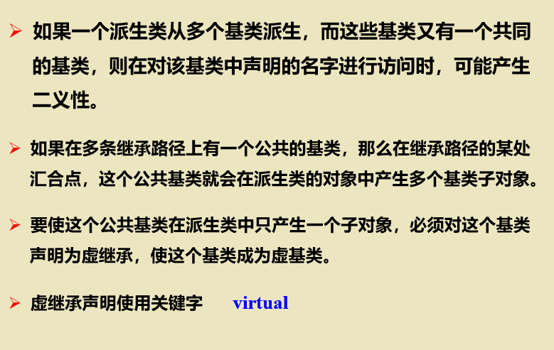

# 第八章 继承

+++


[TOC]

+++

## 8.1 类之间的关系

1. has-A:包含关系，用以描述一个类由多个“部件类”构成。实现has-A关系用类成员表示，即一个类中的数据成员是另一种已经定义的类。

2. uses-A:一个类部分地使用另一个类。通过类之间成员函数的相互联系，定义友元或对象参数传递实现。

3. is-A:机制称为“继承”。关系具有传递性,不具有对称性。

   

   

+++


## 8.2 基类和派生类

1. 继承关系的语法形式

2. 访问控制

   如果忽略访问描述符，默认私有继承。如果是由struct定义的类，则默认公有继承。

   公有继承实例：

   + 变式：修改classA的类型

     报错：

     修改：

     

     原理：**私有数据成员仅在定义层次中可见**

     建议：在日常写代码的时候可以不用protected类型，直接用private类型，在使用的时候采用成员函数返回值。一般继承采用公有继承即可。

     

   私有继承实例：此时A中所有的成员函数和数据成员在B中均可以访问，但是

   + 变式：如果A的成员函数访问控制规则改变了呢？

     + 情况1：修改为public在main函数可以通过A类访问，在B类可见

     + 情况2：修改为protected在main函数不可以通过A类访问，在B类可见

     + 情况3：修改为private在main函数不可以通过A类访问，在B类不可见

       

   + 探讨：如果A类成员为private，B类会为此开辟存储空间吗？通过监视器可以发现确实开辟了存储空间

     

     

     

     

     并且发现在调用B的构造函数时，因为不存在y，所以会先调用A的构造函数，这等价于：

   + 总结：private类型永远只能在定义类中访问，其他都不可以；当建立一个派生对象时，不论访问描述符，不论层次深度，总是要对所有对象初始化，建立所有数据成员。

2. 访问声明

   由于访问描述符，部分原本是可见的成员在派生类中不可见，此时可以通过访问声明修改部分成员的访问控制

   + 访问声明不能带参数和返回类型（值类型），只能是名字
   + 不能对private成员调整访问权限（但可以对其他成员提升或降低访问权限，这与书本有所不同，待进一步探究）
   + 若重载函数具有相同访问控制属性，则通过访问声明可以同时调整访问权限但如果具有不同属性则均不能被调整访问权限
   + 若派生类有同名函数，则对基类成员函数可以被访问声明，但当函数被调用时，只调用派生类中的同名函数（这一点与书本不同，待探究）
   
3. 重名成员

   在默认情况下，直接调用只会调用属于派生类的成员；调用基类同名成员需要使用类名限定符

   

   重名数据成员实例：

   派生类的重名成员屏蔽基类的同名成员

   

   重名成员函数实例：派生类屏蔽基类同名成员函数调用自身的成员函数

   

4. 在派生类访问静态成员

   

   即基类所有对象和派生类所有对象都可以访问**同一个**静态成员对于类的静态成员访问，建议使用 *类名：：成员* 方式访问

   


+++


## 8.3 基类的初始化


1. 构造函数无参数实例：

   但还是建议写成形式，方便理解

2. 带参数构造函数实例：这里构造函数需要五个参数:p1、p2被基类构造函数调用，p3、p4用于初始化data4数据成员并且又调用一次基类的构造函数，p5用于初始化data3数据成员。

3. 初始化顺序：基类->对象成员->派生类（不论编写时的顺序）这个例子说明了当创建对象的时候，会先给所有成员开辟空间，然后按照固定顺序执行构造函数，而不是按照编写顺序。

## 8.4 继承的应用实例

1. 三层继承关系：

   

2. ```c++
   #include<iostream>
   #include <iomanip>
   using namespace std;
   
   class Point
   {
       friend ostream& operator<< (ostream&, const Point&);
   public:
       Point(int = 0, int = 0);	// 带默认参数的构造函数
       void setPoint(int, int);	// 对点坐标数据赋值
       int getX() const { return x; }	    int getY() const { return y; }
   protected:    int x, y;	// Point类的数据成员
   };
   class Circle : public Point
   {
       friend ostream& operator<< (ostream&, const Circle&);	// 友元函数
   public:
       Circle(double r = 0.0, int x = 0, int y = 0);	// 构造函数
       void setRadius(double);  /*置半径*/          double getRadius() const;     /*返回半径*/
       double area() const;		// 返回面积
   protected:    double radius;	// 数据成员，半径
   };
   class Cylinder :public Circle
   {
       friend ostream& operator<<(ostream&, const Cylinder&);    // 友元函数
   public:
       Cylinder(double h = 0.0, double r = 0.0, int x = 0, int y = 0);      // 构造函数
       void setHeight(double);    /* 置高度值*/           double getHeight() const;	    /* 返回高度值*/
       double area() const;	     /* 返回面积*/            double volume() const;	    /* 返回体积*/
   protected:     double height;	// 数据成员，高度
   };
   
   // Point 类的成员函数 
   // 构造函数，调用成员函数对 x，y作初始化
   Point::Point(int a, int b)
   {
       setPoint(a, b);
   }
   // 对数据成员置值
   void Point::setPoint(int a, int b) { x = a;  y = b; }
   // 重载插入算符，输出对象数据
   ostream& operator<< (ostream& output, const Point& p)
   {
       output << '[' << p.x << "," << p.y << "]";
       return output;
   }
   
   // Circle 类的成员函数 
   // 带初始化式构造函数，首先调用基类构造函数
   Circle::Circle(double r, int a, int b) : Point(a, b) { setRadius(r); }
   // 对半径置值
   void Circle::setRadius(double r) { radius = (r >= 0 ? r : 0); }
   // 返回半径值
   double Circle::getRadius() const { return  radius; }
   // 计算并返回面积值
   double Circle::area() const { return  3.14159 * radius * radius; }
   // 输出圆心坐标和半径值
   ostream& operator<< (ostream& output, const Circle& c)
   {
       output << "Center = " << '[' << c.x << "," << c.y << "]" << "; Radius = "
           << setiosflags(ios::fixed | ios::showpoint) << setprecision(2) << c.radius;
       return  output;
   }
   
   // Cylinder 类的成员函数
   // 带初始化式构造函数，首先调用基类构造函数 
   Cylinder::Cylinder(double h, double r, int x, int y) :Circle(r, x, y) { setHeight(h); }
   // 对高度置值
   void Cylinder::setHeight(double h) { height = (h >= 0 ? h : 0); }
   // 返回高度值
   double Cylinder::getHeight() const { return height; }
   // 计算并返回圆柱体的表面积
   double Cylinder::area() const { return  2 * Circle::area() + 2 * 3.14159 * radius * height; }
   // 计算并返回圆柱体的体积
   double Cylinder::volume() const { return  Circle::area() * height; }
   // 输出数据成员圆心坐标、半径和高度值
   ostream& operator<< (ostream& output, const Cylinder& cy)
   {
       output << "Center = " << '[' << cy.x << "," << cy.y << "]" << "; Radius = "
           << setiosflags(ios::fixed | ios::showpoint) << setprecision(2) << cy.radius
           << "; Height = " << cy.height << endl;
       return output;
   }
   
   int main()
   {
       Point p(72, 115);		//定义点对象并初始化
       cout << "The initial location of p is " << p << endl;
       p.setPoint(10, 10);		//置点的新数据值
       cout << "\nThe new location of p is " << p << endl;	//输出数据
       Circle c(2.5, 37, 43);	//定义圆对象并初始化
       cout << "\nThe initial location and radius of c are\n" << c << "\nArea = " << c.area() << "\n";
       //置圆的新数据值
       c.setRadius(4.25);    c.setPoint(2, 2);
       //输出圆心坐标和圆面积
       cout << "\nThe new location and radius of c are\n" << c << "\nArea = " << c.area() << "\n";
       Cylinder cyl(5.7, 2.5, 12, 23);	//定义圆柱体对象并初始化
       //输出圆柱体各数据和表面积，体积
       cout << "\nThe initial location, radius ang height of cyl are\n" << cyl
           << "Area = " << cyl.area() << "\nVolume = " << cyl.volume() << '\n';
       //置圆柱体的新数据值
       cyl.setHeight(10);   cyl.setRadius(4.25);    cyl.setPoint(2, 2);
       cout << "\nThe new location, radius ang height of cyl are\n" << cyl
           << "Area = " << cyl.area() << "\nVolume = " << cyl.volume() << "\n";
   }
   
   
   ```

3. 对比继承关系和包含关系

   1. ```c++
      //用继承方式设计Point类和Circle类 
      #include<iostream>
      using namespace std ;
      class Point
      { public :
            Point(double t1, double t2)  { x=t1; y=t2;}
            void OutPoint() { cout << "Point: x=" << x << " y=" << y << endl ; }
        protected :    double x, y;
      };
      class Circle : public Point		//Circle类继承Point类
      { public:
             Circle(double t1,double t2, double t3)  :  Point(t1,t2)	 { radius = t3 ; }
             void OutCircle()
                 {   Point::OutPoint();      cout << "radius=" << radius << endl ;  }
        protected:    double radius;	//派生类数据成员
      };
      int main()
      { Circle c( 0, 0, 12.5 ) ;
        c.OutPoint() ;	//调用从基类Point继承的成员函数
        c.OutCircle() ;	//调用Circle类成员函数
      } 
      
      ```

   2. ```c++
      //用包含方式设计Point类和Circle类(不建议，不能达到信息隐藏目的)
      #include<iostream>
      using namespace std ;
      class Point
      { public :
            Point(double t1, double t2)  { x=t1; y=t2;}
            void OutPoint() { cout << "Point: x=" << x << " y=" << y << endl ; }
        protected :    double x, y;
      };
      class Circle 
      { public:
             Circle(double t1,double t2, double t3)  :  centre(t1,t2)    { radius = t3 ; }
             void OutCircle()
                 {   centre.OutPoint();      cout << "radius=" << radius << endl ;  }
             Point  centre;		 //包含Point成员
        protected:    double radius;	
      };
      int main()
      { Circle c( 0, 0, 12.5 ) ;
        c.centre.OutPoint() ;	//通过成员centre调用Point的成员函数
        c.OutCircle() ;		//调用Circle类成员函数
      } 
      
      ```

      

   +++

   

   

## 8.5 多继承


1. 简单运用

   1. 
   2. 各个继承类的构造顺序取决于继承顺序
   3. 注意默认的访问控制符这里B看上去是以public方式继承，实际上是默认的private继承。

2. 虚基类

   一个类不能被多次说明为一个派生类的直接基类，但可以不止一次地成为间接基类。

   1. 二义性的产生看一个二义性实例：分析一下构造顺序:

   2. 虚基类

      + 不采用virtual情况

      + 采用virtural情况

        或

        

      + 记忆顺序：虚基类->直接基类->派生基类
   
      + 当出现间接虚基类时，若要使用带参数的构造函数，要在派生类直接对间接虚基类初始化。
      
        当改为时，不论在派生类是否初始化都会有问题（待探究)
      
        当改为间接非虚基类时，不能直接初始化
      
      

