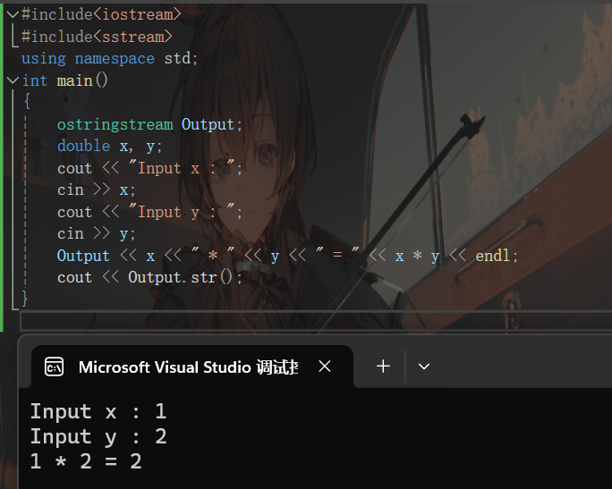
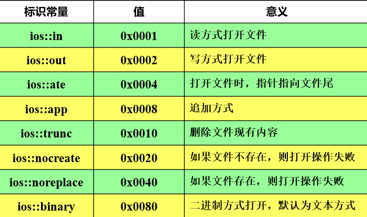
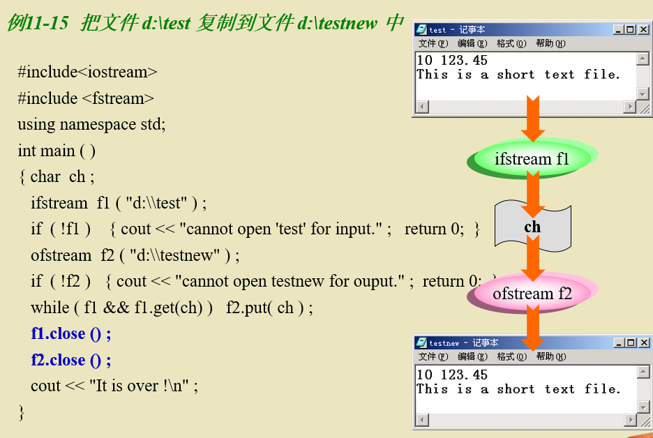
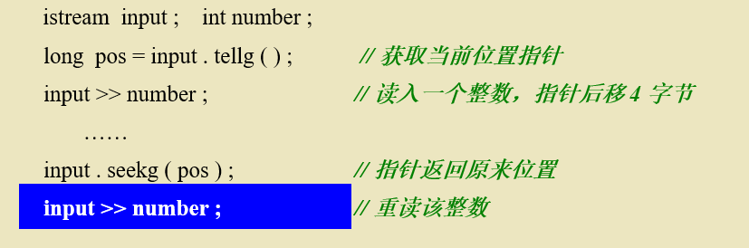

# 第十一章 输入输出流

+++


[TOC]

+++


## 11.1 流类和流对象


从流中获取数据称为提取，向流中添加数据称为插入。

### 流类库


>filebuf:文件缓冲区管理
>
>strstreambuf:字符串缓冲区管理
>
>stdiobuf:标准I/O缓冲区管理   


### 头文件

iostream类库的接口部分包含在几个头文件中，最常用的有一下三个头文件。


+++


## 11.2 标准流和流操作

标准流是c++预定义的对象，提供内存与外部设备进行数据交互功能。

流的操作是流类公有的成员函数。

### 标准流


了解：

### 输入流操作

输入流操作是指输入流对象从流中提取数据，并写入内存。

istream类中的公有成员函数

每个具都有多个重载版本

```c++
//输入流函数使用实例
#include<iostream>
using namespace std;
int main()
{ char c;
  cout << "Enter first sentence followed by Enter\n" ;
  while ( (c = cin.get()) != '\n' )  cout.put(c);
  cout << endl ;
  cout << "Enter second sentence followed by Enter\n" ;
  while ( cin.get(c) )
      { if ( c=='\n' ) break;  cout.put(c); }
  cout << endl ;
  cout << "Enter third sentence followed by Enter\n" ;
  char s[ 80 ] ;
  cin.get ( s, 10 ) ;
  cout << s << endl ;
}

```


均是通过输入流函数控制输入满足某个值时读取。


read()函数更适合读取文件到内存，不涉及缓冲和格式化；get()函数更适合字符或字符串的读取，尤其是空白字符。


### 输出流操作

输出流操作是指把内存中的数据插入流中。

ostream类的公有成员函数

每一个函数都有多种重载版本


### 流错误状态

ios类中定义了记录流错误状态的数据成员，称为状态字。状态字的每一位对应一种流的错误状态，顶有一个对应的标识常量。	


`````c++
#include <iostream>
#include <fstream>

int main() {
    std::ifstream file("example.txt");

    // 检查流状态
    if (file.eof()) {
        std::cout << "End of file reached." << std::endl;
    }
    if (file.fail()) {
        std::cout << "Last operation failed." << std::endl;
        file.clear(); // 清除错误标志，允许后续操作
    }
    if (!file.good()) {
        std::cout << "Stream is not in a good state." << std::endl;
    }

    // 设置流状态
    file.setstate(std::ios::failbit); // 手动设置 failbit

    // 再次检查流状态
    if (file.fail()) {
        std::cout << "Stream failbit is set." << std::endl;
    }

    return 0;
}
`````


+++


## 11.3 格式控制

### 设置标志字

ios类有一个数据成员用于记录当前流的格式化状态，称为标志字。

格式控制标志常量及意义

可以通过运算符“|”同时设置几个标志字。

以下是ios类中控制格式的函数

> 1. **`width()`**：设置或返回下一个输入输出操作的字段宽度。它影响输出时的字符数，以及输入时用于匹配的字符数。
> 2. **`precision()`**：设置或返回用于浮点数和固定点数的精度，即小数点后的位数。对于整数，它指定了基数转换中的数字位数。
> 3. **`flags()`**：返回或设置格式标志。这包括：
>    - `dec`：十进制基数
>    - `hex`：十六进制基数
>    - `oct`：八进制基数
>    - `showbase`：显示基数
>    - `showpos`：显示正号
>    - `uppercase`：大写字母显示
>    - `internal`：填充字符放置在标志与数值之间
>    - `left`：左对齐
>    - `right`：右对齐
> 4. **`setf()`**：设置一个或多个格式标志。
> 5. **`unsetf()`**：清除一个或多个格式标志。
> 6. **`precision(setprecision)`**：设置浮点数的小数点后位数。
> 7. **`fill()`**：设置填充字符，用于在输出时填充空格。
> 8. **`exceptions()`**：设置流的异常掩码，用于控制何时因违反状态而抛出异常。
> 9. **`tie()`**：设置或返回与输入输出流相关联的输出流，用于在输入输出操作之间同步。
> 10. **`rdstate()`**：返回当前流的状态，包括错误标志。
> 11. **`eof()`**：检查是否到达文件末尾。
> 12. **`fail()`**：检查最近的输入输出操作是否失败。
> 13. **`good()`**：检查流的状态是否良好。
> 14. **`clear()`**：清除错误标志。

在输出之前可以预设输出格式

```c++
//格式化输出
#include<iostream>
using namespace std;
int main()
{ double x = 22.0/7 ;
   int i ;
   cout << "output in fixed :\n" ;
   cout.setf( ios::fixed | ios::showpos ) ;	// 定点输出，显示 +
   for( i=1; i<=5; i++ )
      { cout.precision( i ) ;  cout << x << endl ; }
   cout << "output in scientific :\n" ;
   // 清除原有设置，科学示数法输出
   cout.setf(ios::scientific, ios::fixed|ios::showpos ) ;	
   for( i=1; i<=5; i++ )
      { cout.precision(i) ;   cout << x*1e5 << endl ; }
}

```

在取消fixed格式后precision(i)代表保留i为有效数字，而不是保留i位小数

### 设置格式控制符

控制符是istream和ostream类定义了一批函数，作为重载插入运算符 <<或提取运算符 >>的右操作数控制I/O格式。（推荐使用格式控制符）

iostream类中常用的控制符

iomanip类中的控制符（用于设置ios类中的标志字）

```c++
//整数的格式化输出
#include <iostream>
#include <iomanip>
using namespace std ;
int main()
{ const int k = 618 ;
   cout << setw(10) << setfill('#') << setiosflags(ios::right) << k <<endl ;
   cout << setw(10) << setbase(8) << setfill('*')
           << resetiosflags(ios::right) << setiosflags(ios::left) << k << endl ;
} 
```

+++


## 11.4 串流

字符串串流和标准流对象一样用于数据输入和输出的对象，用文本流I/O的方式操纵内存中的string对象或者字符串。


> 1. **sstream** - 定义了基于字符串的输入输出流类 `istringstream`、`ostringstream` 和 `stringstream`，推荐使用。
> 2. **strstream**-旧版本处理字符串输入输出的主要方式，已经被`sstream`取代。

### 输入串流提取对象


testStr是输入串流的被连接对象。

input是 istringstream 类的一个输入串流对象，具有多个不同的构造函数。以下方法都是合法的（不止这两种）。

```c++
istringstream iss("The answer is 42");//编译器会自动生成一个匿名对象string
```

```c++
string str = "The answer is 42";
istringstream iss(str);
```


### 输出串流中插入数据



这个例子演示了从键盘输入两个数然后通过输出串流插入输出乘法算式，其中Output.str()函数是以字符串格式输出输出流中的元素

Output是ostringstream类的一个输出串流对象，本例种没有被连接的string对象，会自动生成匿名对象作为输出缓冲区。

```c++
const char* chars = "Initial content";
std::ostringstream oss(chars);//这样构造输出串流也是可以的	
```


+++


## 11.5 文件处理


文本文件本质上还是二进制文件，只不过文本文件一般是通过ascii或者unicode编码，每条数据是定长的

[可以通过这篇文章详细了解二进制文件与文本文件的异同](https://www.jianshu.com/p/af0b4f8b030e)

文本文件可以简单通过一个表示常量EOF（End Of File)（称为文本结束符）识别文本结束；而二进制文件只能通过数据或指针位置判断完整性或文件是否结束。

### 文件和流


### 打开和关闭文件

文件操作的基本方式：打开文件->读/写文件->关闭文件

#### 打开文件

两种方式：

open函数用于打开文件

一个参数表示文件名，第二个参数表示打开方式，第三个参数表示文件的保护方式（具有默认值filebuf::openprot)

mode参数包含：

文件保护参数包含：


两种打开方式比较


如果不直接指定地址，会默认在cpp所在的地址下。

创建一个文件写的时候可以指定任意的文件格式，即.txt .doc甚至自定义.myfile都可以，区别只是系统能不能打开

#### 关闭文件


```c++
//open() close()函数应用实例
#include<iostream>
#include<fstream>
using namespace std;
int main ( )
{ ofstream  ost ;		 
   ost . open ( "c:\\my1.txt ") ;// 要注意这里\\实际上有一个\是转义，因此实际上是C:\my.txt
   ost << 20 << endl ;	
   ost << 30.5 << endl ;
   ost . close ( ) ;		
   ifstream  ist ( "c:\\my1.txt" ) ;	
   int  n ;
   double  d ;
   ist >> n >> d ;		
   cout << n << endl << d << endl ;
}
//运行结束可以打开电脑C盘看看是否存在my1.txt文件
```

| 流对象所属的类 | 作用            |
| -------------- | --------------- |
| ifstream       | 以写方式打开    |
| ofstream       | 以读方式打开    |
| fstream        | 以读/写方式打开 |


### 文本文件


#### 对文本文件简单操作

```c++
//文本文件格式控制
#include<fstream>
#include <iomanip>
using namespace std;
int main ( )
{ ofstream  ost ;
   ost.open ( "d:\\my2.dat" ) ;
   ost << "1234567890" << endl ;
   int  a = 123 ;
   ost << a << endl ;
   ost << setw ( 10 ) << a << endl ;
   ost << resetiosflags ( ios :: right ) << setiosflags ( ios :: left )
        << setfill ( '#' ) << setw ( 10 ) << a << endl ;
   ost << resetiosflags ( ios :: left ) << setiosflags ( ios :: right )
        << setprecision ( 5 ) << setw ( 10 ) << 12.34567890 << endl ;//setfill ( '#' )设定后不需要多次重写，之后的ost输出流默认填充#
   ost . close ( ) ;
}

```

```c++
//利用if语句判断能否打开文件
#include<iostream>
#include<fstream>
using namespace std;
int main()
{ ofstream out( "d:\\test" ) ;
   if ( !out )
      { cout << "cannot open file. " ;   return 0;  }
   out << 10 << " " << 123.45 << " " ;
   out << "\nThis is a short text file." ;
   out.close () ;
   return 1 ;
}

```

如果文件不存在 !out == TRUE。

如果文件能打开，则out是一个地址值（指针），如果不能打开，则是一个空指针

一个文本复制的实例

一个文本追加的实例

要注意：**追加str一定要指定f2的ios::app操作**，如果不写iso::app，str会取代前面的所有内容，因此最好在追加元素之前最好备份文件

实例：读取文本文件，显示每个学生的数据，并计算最大值，最小值，平均分

```c++
#include<iostream>
#include <fstream>
using namespace std;
int main()
{ char name[30] , s[80] ;   
   int number , score ;   int n = 0, max, min, total = 0 ;  double ave;
 
   ifstream instuf( "d:\\students.txt", ios::in ) ;	
   if ( !instuf )
      { cerr << "File could not be open." << endl ;   abort();   }//读取文件
 
   instuf.getline( s, 80 ) ;//这一行的作用是略去标题行，将指针指向下一行			
 while( instuf >> number >> name >> score ) 	
     { cout << number << '\t' << name << '\t' << score << '\n' ;	
        if (n==0) { max = min = score; }		
	  else  { if ( score > max ) max = score ;    if ( score < min ) min = score ;   }
       total+=score;      n++;			
     }
   ave = double(total) / n ;
   cout << "maximal is : " << max << endl << "minimal is : " << min << endl
	  << "average is : ” << ave << endl; 	
  instuf.close() ;	
}

```

```c++
//浏览文件，跳过n行后输出
#include<iostream>
#include<fstream>
using namespace std;
void browseFile( char * , int );
int main()
{ char fileName[80];
  cout << "请输入要打开的文件名：" ;
  cin >> fileName ;
  browseFile(fileName, 1 );
}
void browseFile( char * fileName, int delLine )
{ ifstream inf( fileName, ios::in ) ;
  char s[80];
  for ( int i=1; i <= delLine; i++ )
      inf.getline( s, 80 ) ;
  while( !inf.eof() )
  { inf.getline( s, 80 ) ;
    cout << s << endl ;
  }//inf.eof()返回的是是否读取到文件末尾，这里!inf.eof()和!inf是等效的
 inf.close() ;
}

```

#### 提取文本数据的其他操作


对于第二个参数stringsize，如果设置为n，那么实际读取只会读取n-1个字符，第n个设置为\0。(第n个这里没研究究竟是什么，存疑)

```c++
//get()和getline()区别
#include<iostream>
using namespace std;
int main ( )
{ char  buf [ 80 ] ;
   cin.get ( buf , 80 , 'y' ) ;	
   cout << buf << endl ;
   cin.get ( buf , 80 ) ; 	
   cout << buf << endl ;
   cin.getline ( buf , 80 , 'n' ) ;
   cout << buf << endl ;
   cin.get ( buf , 80 ) ; 	
   cout << buf << endl ;
   return ;
}
```


两者都可以通过规定截至的字符规定读取，cin.get()不会将截止的字符读取进存储对象，也不会在流中清除截止字符；而cin.getline()也不会将截止字符读取进存储对象，但是会在输入流中清除。两者默认读取到‘\n’截止。要注意：**由于输入的特性使用\<Enter>时，会向输入流中添加\\n，因此要警惕读取的流中有\\n存在**。


### 二进制文件


#### 二进制数据文件


#### 随机访问流


> beg:流起始的指针位置
>
> cur:流当前指针的位置
>
> end:流末尾的指针位置

#### istream 类操作流读指针的成员函数


一个循环读取某段数据的位置思路



#### ostream类操作流写指针的成员函数


#### 适于二进制流操作的成员函数

操作对象是流当前指针所指单字节数据

由于二进制文件对于字符的存储和文本文件一样（前提是这些字符都是ascii码编码)，这些函数也可以适用于操作存储数据均是ascii码的文本文件，并且不会跳过空白字符


注意：read()函数、write()函数参数一定要强制类型转换为char*，关于指针移动的字节数一定要是long类型

#### 操作实例

```c++
//一个综合二进制文件操作
#include <fstream>
#include<iostream>
using namespace std;
int main()
{
    int i, j;
    fstream f;
    f.open("C:Data.dat", ios::out | ios::binary);
    for (i = 1; i <= 10; i++)
        f.write((char*)&i, sizeof(int));
    f.close();
    f.open("C:Data.dat", ios::in | ios::out | ios::binary);
    for (i = 0; i < 10; i++)
    {
        f.seekg(long(sizeof(int) * i));
        f.read((char*)&j, sizeof(int));
        if (j % 2)
        {
            j += 10;
            f.seekp(-long(sizeof(int)), ios::cur);
            f.write((char*)&j, sizeof(int));
        }
    }
    f.seekg(long(sizeof(int) * 10));
    for (i = 91; i <= 95; i++)
        f.write((char*)&i, sizeof(int));
    f.seekg(0, ios::beg);
    for (i = 0; i < 15; i++)
    {
        f.read((char*)&j, sizeof(int));
        cout << j << " ";
    }
    cout << endl;
    f.close();
}

```

